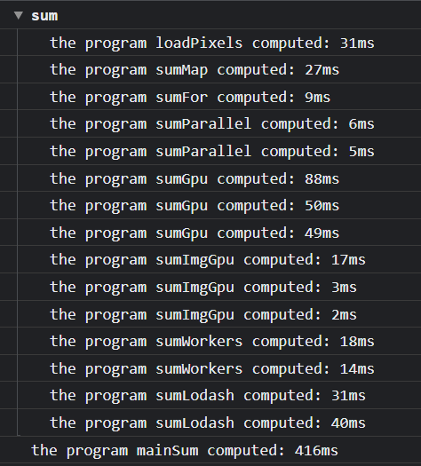
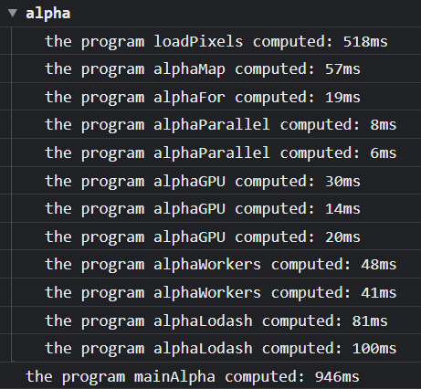

# FL2

Сomparison of methods for processing an array of numbers

## how to build the project

1. yarn
2. yarn start
   or
   open index.html

# sum function

the task is to add 1 image to each pixel color.



to solve this problem , 6 functions were written

## 1. sumMap (the worst method)

adds a unit using the map method. As you can see, this is the slowest way. Most likely it is slow due to the fact that you have to call the function separately for each color

```javascript
async function sumMap() {
  return pixels.map((e) => e + 1);
}
```

## 2. sumFor

adds a unit using the for loop. this method is fast enough with simple processing functions

```javascript
async function sumFor() {
  let { length } = pixels;
  let res = new Uint8ClampedArray(length);
  for (let i = 0; i < length; i++) {
    res[i] = pixels[i];
  }
  return res;
}
```

## 3. sumParallel()

adds a unit using the Parallel.js. the processing speed is accelerated by dividing the task into threads in the node.js (using worker_threads) and splitting into working web processes on web js.

```javascript
async function sumParallel() {
  let par = new Parallel(pixels.slice());
  let res = par.map((e) => e + 1);
  return res.data;
}
```

## 4. sumGpu()

adds a unit using the GPU.js. the processing speed is accelerated by spreading the task into threads on the video card. It works slowly on simple tasks due to the slow speed of loading and unloading data from the video card. When called more than once, the function works several times faster

```javascript
const gpuSum = new GPU();
let Sum;
function sumKernalCreate() {
  let { length } = pixels;
  Sum = gpuSum.createKernel(
    function (arr) {
      return arr[this.thread.x] + 1;
    },
    { output: [length], graphical: false }
  );
}
async function sumGpu() {
  return Sum(pixels);
}
```

## 5. sumImgGpu()

adds a unit using the GPU.js. the processing speed is accelerated by spreading the task into threads on the video card as in 4 functions. Unlike 4 method, it already works with an image, not an array of colors and returns a ready-made canvas.

```javascript
function sumImageKernalCreate() {
  let { length } = pixels;
  let { width: w, height: h } = img;

  SumImage = gpu.createKernel(
    function (image) {
      const pixel = image[this.thread.y][this.thread.x];
      this.color(pixel[0], pixel[1], pixel[2], pixel[3]);
    },
    { output: [w, h], graphical: true }
  );
  document.body.appendChild(gpu.canvas);
}
async function sumImgGpu() {
  return SumImage(img);
}
```

## 6. sumWorkers()

splits the task into a number of asynchronous functions (in this case 32), which can speed up the process when performing large tasks.

```javascript
async function sumWorkers() {
  let { length } = pixels;
  let buf = new Uint8ClampedArray(length);
  let process = async (workersCount, start) => {
    for (let i = start; i < length; i += workersCount) {
      buf[i] = pixels[i] + 1;
    }
  };
  let workers = [];
  let count = 32;
  for (let i = 0; i < count; i++) workers.push(process(count, i));
  await Promise.all(workers);
  return buf;
}
```

# alpha function

the task is to multiply each color of 2 and to make alpha chanel as 0;


to solve this problem , 5 functions were written

1. alphaMap
2. alphaFor
3. alphaParallel
4. alphaGPU
5. alphaWorkers

## used technologies

- electron.js
- parallel.js
- gpu.js
